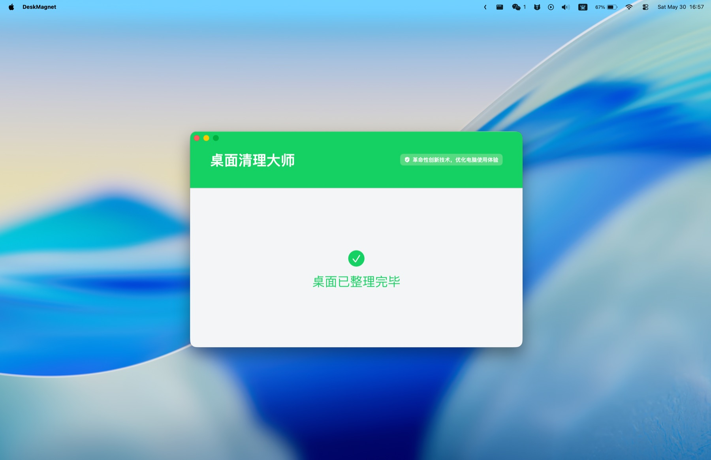

# DeskMagnet

English | [简体中文](README.md)

DeskMagnet is a macOS Finder desktop icon magnet. The app name is localized for users. When you clean the desktop, it does not delete, rename, or move files on disk. It only changes Finder desktop icon coordinates temporarily, places the icons behind the app window, and restores the icons plus Finder desktop settings when you quit or restore.



This project currently supports macOS only. The core behavior depends on Finder AppleScript, the macOS desktop coordinate system, and an `.app` bundle. Windows and Linux are not supported.

## Features

- Reads Finder desktop icons and their original coordinates.
- Temporarily disables Finder desktop auto-arrangement so icons can be moved.
- Calculates a hidden projection area from the window position and tucks icons behind the window.
- Syncs icons while the window moves, with adaptive throttling for larger desktops.
- Restores the desktop when quitting, closing the window, or detecting unfinished state.
- Uses the same `Scripts/build-app.sh` entry point locally and in GitHub Actions.

## Safety

DeskMagnet only changes Finder desktop icon display coordinates and temporary Finder desktop layout settings. It does not delete files, rename files, or move filesystem paths.

On first real cleanup, macOS asks whether DeskMagnet may control Finder. If permission is denied, the app shows an Automation permission error. You can manage it later in System Settings -> Privacy & Security -> Automation.

## Menus and Language

The app follows the system language by default. You can also switch languages from the macOS menu bar: English, Simplified Chinese, Japanese, Traditional Chinese, Spanish, French, Portuguese, Korean, German, and Hindi.

The cleanup action is exposed as its own top-level menu. The main app menu keeps Restore Desktop and Quit. If Finder steals focus during cleanup, the app brings its main window back when the operation finishes.

## Local Development

```bash
swift build --product DeskMagnetApp
swift test
Scripts/build-app.sh
```

The built app is located at:

```text
build/桌面清理大师.app
```

`Scripts/build-app.sh` runs the release build, assembles the `.app`, writes `Info.plist`, copies the `.icns`, and validates the ad-hoc signature. It is the only app packaging entry point used by local builds and CI.

## Local Run

```bash
open "build/桌面清理大师.app"
```

If macOS adds a quarantine flag after downloading a browser or GitHub artifact build:

```bash
xattr -dr com.apple.quarantine "build/桌面清理大师.app"
open "build/桌面清理大师.app"
```

The current artifact is an ad-hoc signed `.app`, not an Apple Developer ID signed or notarized build. Public distribution still needs a Developer ID certificate, hardened runtime, `notarytool`, and stapler validation.

## GitHub Runner Packaging

GitHub Actions uses `.github/workflows/build.yml`. Regular pushes and pull requests only run `swift build --product DeskMagnetApp` and `swift test`.

Only two paths create an `.app.zip` artifact:

- Run the workflow manually with `workflow_dispatch`.
- Push a `v*` tag, for example `v1.0.0`.

The packaging job uploads a `桌面清理大师-macOS` artifact containing `桌面清理大师.app.zip`. CI and local builds share `Scripts/build-app.sh`, so a local packaging pass should match the Runner behavior.

## Known Limitations

- macOS only.
- Artifacts are ad-hoc signed, without Developer ID signing or notarization.
- The first real cleanup requires Finder Automation permission.
- With many desktop icons, drag syncing is throttled and a final sync runs after the drag ends.

## Project Structure

```text
Assets/                  App icon assets
Scripts/                 Shared local and CI build scripts
Sources/DeskMagnetApp/   macOS app shell, window, menu, localization, SwiftUI UI
Sources/DeskMagnetCore/  Finder automation, coordinate conversion, layout, recovery state
Sources/DeskMagnetCLI/   Command-line verification entry point
Tests/                   DeskMagnetCore and DeskMagnetApp tests
docs/                    Product spec and reference materials
```

## Inspiration

`docs/win版桌面清理大师参考.mp4` is the creative reference video for this product shape. The original author is currently unknown. If you know the source, please provide a lead or open a PR to add attribution.

## License

[MIT License](LICENSE).
